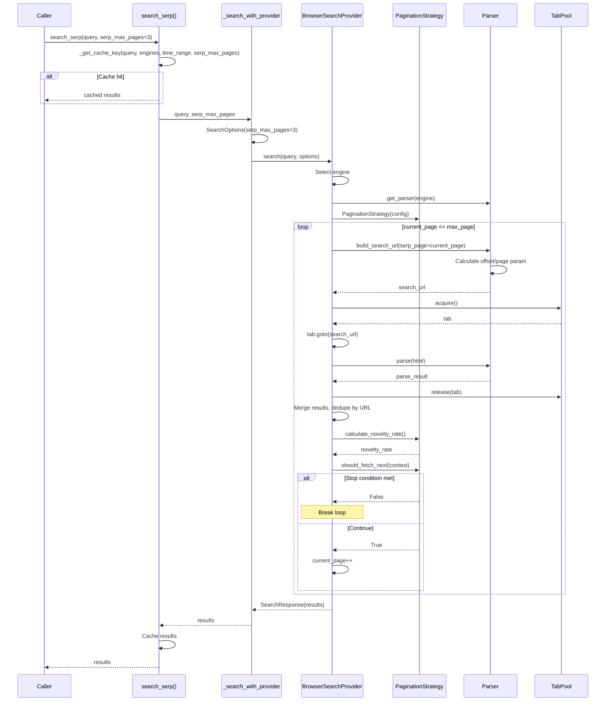

# Phase 5: SERP Pagination Sequence

## Overview

This document describes the data flow for SERP pagination (Phase 5 of Async Architecture).

## Sequence Diagram



## Propagation Map

| Boundary | Parameter | Source | Transform | Sink |
|----------|-----------|--------|-----------|------|
| API | `serp_max_pages` | `search_serp()` arg | Passed as-is | `SearchOptions.serp_max_pages` |
| Options | `SearchOptions.serp_max_pages` | API | Validated (1-10) | `BrowserSearchProvider.search()` |
| Provider | `options.serp_max_pages` | Options | `max_page = serp_page + serp_max_pages - 1` | Pagination loop bound |
| Cache | `serp_max_pages` | API | Included in cache key | `_get_cache_key()` |
| Parser | `serp_page` | Loop counter | `offset = (page - 1) * results_per_page` | URL query param |
| URL | `offset` or `page` | Parser config | Depends on `pagination_type` | Search engine |
| Strategy | `novelty_rate` | Result merge | `new_urls / total_urls` | Stop condition |
| DB | `page_number` | Loop counter | Stored per item | `serp_items.page_number` |

## Stop Conditions

1. **max_pages reached**: `current_page > max_page`
2. **novelty_rate < 0.1**: Too many duplicate URLs
3. **harvest_rate < 0.05**: Too few relevant results (future)
4. **CAPTCHA/Error**: Return partial results if available

## Cache Key Format

```
query|engines|time_range|serp_max_pages={n}
```

Different `serp_max_pages` values produce different cache entries.

