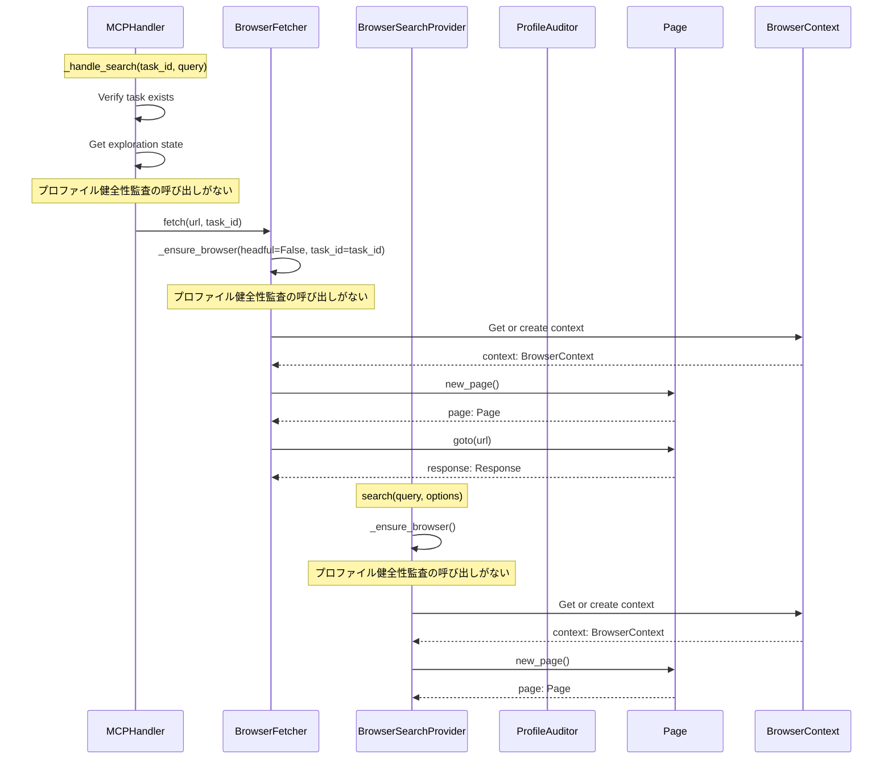
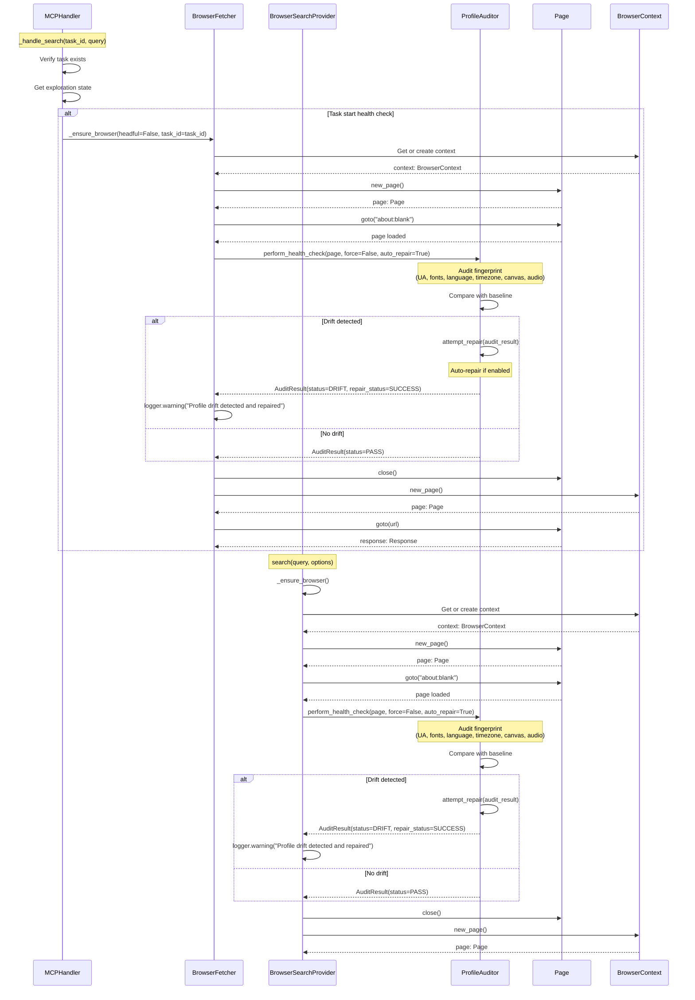

# プロファイル健全性監査の自動実行フロー（問題14）

## 概要

タスク開始時およびブラウザセッション初期化時にプロファイル健全性監査を自動実行するフロー。

## デバッグ前のシーケンス図

## デバッグ後のシーケンス図（実装完了版）

**実装状況**: ✅ 実装完了

**変更点**:
- `BrowserFetcher._ensure_browser()`内で、context作成後に`_perform_health_audit()`を呼び出し
- `BrowserSearchProvider._ensure_browser()`内で、新しいcontext作成時に`_perform_health_audit()`を呼び出し
- 監査は`about:blank`ページで実行し、パフォーマンス影響を最小化
- 監査失敗時も非ブロッキングで通常フローを継続

## データ型

### モジュール間のデータ受け渡し（Pydanticモデル）

モジュール間のデータ受け渡しは、`src/crawler/profile_audit.py`で定義されたPydanticモデルを使用します。

- `AuditResult` (`src/crawler/profile_audit.py`) - 監査結果
  - `status: AuditStatus` - 監査ステータス（PASS/DRIFT/FAIL/SKIPPED）
  - `baseline: FingerprintData | None` - ベースライン指紋データ
  - `current: FingerprintData | None` - 現在の指紋データ
  - `drifts: list[DriftInfo]` - 検出されたドリフト情報のリスト
  - `repair_actions: list[RepairAction]` - 実行された修復アクションのリスト
  - `repair_status: RepairStatus` - 修復ステータス（SUCCESS/FAILED/SKIPPED/PENDING）
  - `error: str | None` - エラーメッセージ（監査失敗時）
  - `duration_ms: float` - 監査実行時間（ミリ秒）
  - `timestamp: float` - 監査実行時刻（Unix timestamp）

- `FingerprintData` (`src/crawler/profile_audit.py`) - 指紋データ
  - `user_agent: str` - ユーザーエージェント文字列
  - `ua_major_version: str` - UAメジャーバージョン（例: "120"）
  - `fonts: set[str]` - 検出されたフォント名のセット
  - `language: str` - ブラウザ言語設定
  - `timezone: str` - タイムゾーンID
  - `canvas_hash: str` - Canvas指紋ハッシュ
  - `audio_hash: str` - Audio指紋ハッシュ
  - `screen_resolution: str` - 画面解像度（例: "1920x1080"）
  - `color_depth: int` - 色深度
  - `platform: str` - プラットフォーム文字列
  - `plugins_count: int` - プラグイン数
  - `timestamp: float` - 取得時刻（Unix timestamp）

- `DriftInfo` (`src/crawler/profile_audit.py`) - ドリフト情報
  - `attribute: str` - ドリフトが検出された属性名
  - `baseline_value: Any` - ベースライン値
  - `current_value: Any` - 現在の値
  - `severity: str` - 深刻度（low/medium/high）
  - `repair_action: RepairAction` - 推奨修復アクション

### その他の型

- `page: Page` - Playwright Pageオブジェクト

## 非同期処理

- `perform_health_check()`: `async def` - プロファイル健全性監査の実行
- `auditor.audit()`: `async def` - 指紋の取得と比較
- `auditor.attempt_repair()`: `async def` - ドリフト検出時の自動修復
- `page.goto()`: `async def` - ページナビゲーション
- `page.close()`: `async def` - ページクローズ

## エラーハンドリング

- `perform_health_check()`が例外を投げた場合: ログ出力してスキップ、通常フロー継続
- 監査が`FAIL`ステータスを返した場合: ログ出力してスキップ、通常フロー継続
- 修復が失敗した場合: ログ出力してスキップ、通常フロー継続
- `about:blank`へのナビゲーションが失敗した場合: ログ出力してスキップ、通常フロー継続

## 実装箇所

- `src/crawler/profile_audit.py` - Pydanticモデル定義（`AuditResult`, `FingerprintData`, `DriftInfo`）および監査ロジック
- `src/crawler/fetcher.py:927-975` - `BrowserFetcher._perform_health_audit()`メソッド追加
- `src/crawler/fetcher.py:877, 923` - `BrowserFetcher._ensure_browser()`での監査呼び出し追加（headful/headless両方）
- `src/search/browser_search_provider.py:248-290` - `BrowserSearchProvider._perform_health_audit()`メソッド追加
- `src/search/browser_search_provider.py:231` - `BrowserSearchProvider._ensure_browser()`での監査呼び出し追加（新しいcontext作成時のみ）

**検証スクリプト**: `tests/scripts/debug_profile_health_audit_flow.py`

## 注意点

- 監査は最小限のページ（`about:blank`）で実行してパフォーマンス影響を最小化
- 自動修復が有効な場合、修復後に再監査を実行
- 監査ログを構造化記録
- 監査失敗時も非ブロッキングで通常フローを継続
- `BrowserSearchProvider`では、既存のcontextを再利用する場合は監査をスキップ（新しいcontext作成時のみ実行）

