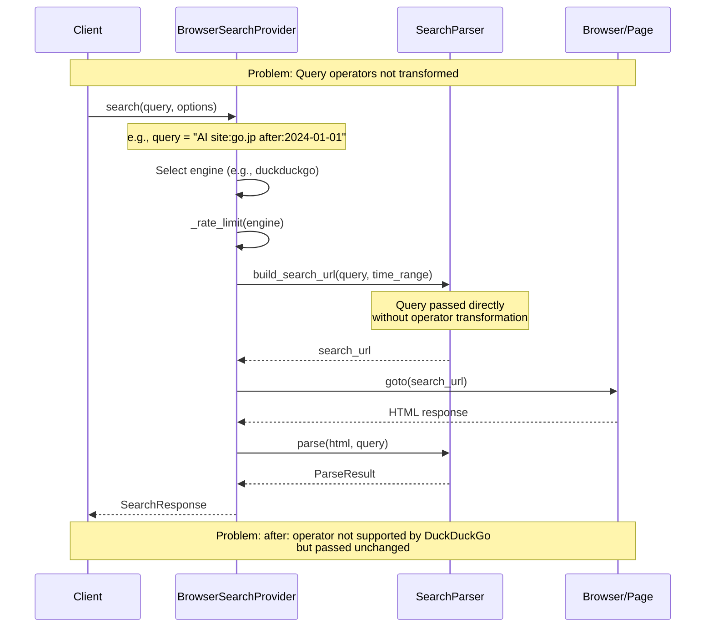
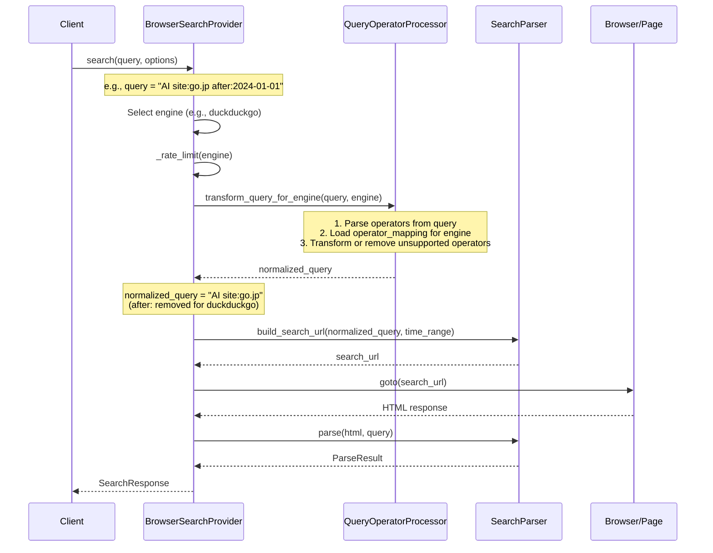

# エンジン正規化レイヤ（クエリ演算子変換）フロー（問題16）

## 概要

BrowserSearchProvider.search()でクエリ演算子をエンジン別構文に変換するフロー。
config/engines.yamlで定義されたoperator_mappingを使用し、各エンジンに適した演算子構文に変換する。

## 仕様要件

- **§3.1.1**: "クエリ演算子（site:, filetype:, intitle:, "..."、+/-、after:）の処理"
- **§3.1.4**: "エンジン正規化（演算子のエンジン別構文への変換）"

## デバッグ前のシーケンス図



## 問題点

1. **演算子変換なし**: クエリ演算子がそのままパーサーに渡され、エンジン固有の構文に変換されない
2. **未対応演算子の処理なし**: `after:`のようにDuckDuckGoでサポートされていない演算子がそのまま渡される
3. **operator_mapping未使用**: config/engines.yamlで定義された演算子マッピングが活用されていない

## 演算子サポート状況

| 演算子 | Google | DuckDuckGo | Bing | Brave | Mojeek |
|--------|--------|------------|------|-------|--------|
| site: | ✅ | ✅ | ✅ | ✅ | ✅ |
| filetype: | ✅ | ✅ | ✅ | ✅ | ✅ |
| intitle: | ✅ | ✅ intitle: | ✅ | ✅ | ❌ |
| "exact" | ✅ | ✅ | ✅ | ✅ | ✅ |
| -exclude | ✅ | ✅ | ✅ | ✅ | ✅ |
| after: | ✅ | ❌ | ❌ | ❌ | ❌ |

---

## デバッグ後のシーケンス図



## データ型

### 使用する既存データ構造

#### ParsedOperator (dataclass - `src/search/search_api.py`)

```python
@dataclass
class ParsedOperator:
    operator_type: str  # "site", "filetype", "intitle", "exact", "exclude", "date_after"
    value: str          # operator value (e.g., "go.jp", "pdf")
    original: str       # original text (e.g., "site:go.jp")
```

#### ParsedQuery (dataclass - `src/search/search_api.py`)

```python
@dataclass
class ParsedQuery:
    base_query: str                    # query text without operators
    operators: list[ParsedOperator]    # extracted operators
    
    def has_operator(self, op_type: str) -> bool: ...
    def get_operators(self, op_type: str) -> list[ParsedOperator]: ...
```

### QueryOperatorProcessor (class - `src/search/search_api.py`)

```python
class QueryOperatorProcessor:
    PATTERNS: dict[str, re.Pattern]  # regex patterns for operator extraction
    _operator_mapping: dict          # loaded from config/engines.yaml
    
    def parse(self, query: str) -> ParsedQuery: ...
    def transform_for_engine(self, parsed: ParsedQuery, engine: str) -> str: ...
    def get_supported_operators(self, engine: str) -> list[str]: ...
```

### ヘルパー関数

```python
def parse_query_operators(query: str) -> ParsedQuery:
    """Parse query string into ParsedQuery."""
    ...

def transform_query_for_engine(query: str, engine: str) -> str:
    """Transform query operators for specified engine."""
    ...
```

## 処理フロー詳細

### 1. 演算子パース

```
Input: "AI研究 site:go.jp filetype:pdf after:2024-01-01"

ParsedQuery:
  base_query: "AI研究"
  operators:
    - ParsedOperator(type="site", value="go.jp", original="site:go.jp")
    - ParsedOperator(type="filetype", value="pdf", original="filetype:pdf")
    - ParsedOperator(type="date_after", value="2024-01-01", original="after:2024-01-01")
```

### 2. エンジン別変換（DuckDuckGo）

```
operator_mapping (from engines.yaml):
  duckduckgo:
    site: "site:{value}"
    filetype: "filetype:{value}"
    intitle: "intitle:{value}"
    exact: '"{value}"'
    exclude: "-{value}"
    date_after: null  # Not supported

Output: "AI研究 site:go.jp filetype:pdf"
        (after: operator removed)
```

### 3. エンジン別変換（Google）

```
operator_mapping (from engines.yaml):
  google:
    site: "site:{value}"
    filetype: "filetype:{value}"
    intitle: "intitle:{value}"
    exact: '"{value}"'
    exclude: "-{value}"
    date_after: "after:{value}"  # Supported

Output: "AI研究 site:go.jp filetype:pdf after:2024-01-01"
        (all operators preserved)
```

## エラーハンドリング

- **空クエリ**: 空文字列をそのまま返す
- **演算子なし**: クエリをそのまま返す
- **未知のエンジン**: デフォルトマッピング（Google互換）を使用
- **パースエラー**: 元のクエリをそのまま返す（フォールバック）

---

## 実装ファイル

| ファイル | 変更内容 |
|---------|---------|
| `src/search/browser_search_provider.py` | search()に`transform_query_for_engine()`呼び出しを追加 |

## 検証

- `tests/scripts/debug_query_normalizer_flow.py` - デバッグ用スクリプト
- `tests/test_browser_search_provider.py` - ユニットテスト（TestQueryNormalizationクラス）
- `tests/test_search.py` - QueryOperatorProcessor単体テスト（既存）
