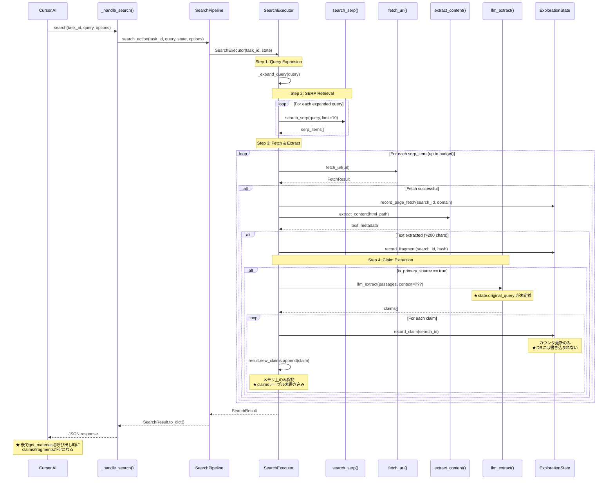
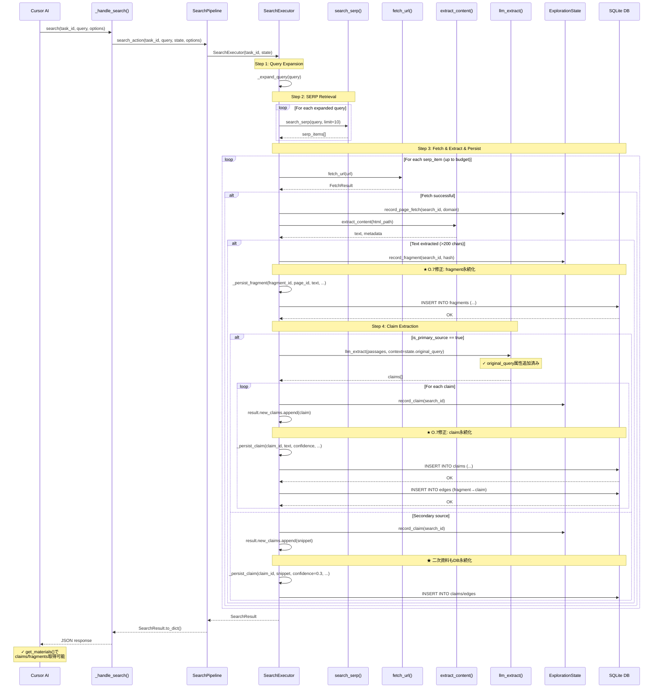

# searchパイプラインフロー（問題1: パイプライン連動）

## 概要

MCPツール`search`がCursor AIから呼び出された際の、検索→取得→抽出→claims構築→DB永続化までの一連のフロー。

## 仕様要件

- **§3.2.1**: `search(task_id, query, options?)` → 検索クエリの実行
- **§2.1.3**: Lyraの処理範囲 - 機械的展開、取得・抽出パイプライン、メトリクス計算
- **§3.3**: フィルタリングと評価（Local LLM）- 事実/主張抽出

## 期待される出力スキーマ

```json
{
  "ok": true,
  "search_id": "s_001",
  "query": "検索クエリ",
  "status": "satisfied|partial|exhausted",
  "pages_fetched": 15,
  "useful_fragments": 8,
  "harvest_rate": 0.53,
  "claims_found": [
    {"id": "c_001", "text": "...", "confidence": 0.85, "source_url": "...", "is_primary_source": true}
  ],
  "satisfaction_score": 0.85,
  "novelty_score": 0.42,
  "budget_remaining": {"pages": 45, "percent": 37}
}
```

## デバッグ前のシーケンス図



### 問題点

1. **ExplorationState.original_query未定義**: `executor.py:475`で`self.state.original_query`を参照するが、ExplorationStateにこの属性がない → AttributeError
2. **DB永続化の欠如**: claims/fragments/edgesがDBに書き込まれない → `get_materials()`が空を返す
3. **record_claim()はカウンタのみ**: DB書き込みなしでカウンタ更新のみ

---

## デバッグ後のシーケンス図（実装完了版）

**実装状況**: ✅ 実装完了・動作確認済み

**変更点**:
- `ExplorationState`に`original_query`属性を追加
- `_persist_fragment()`/`_persist_claim()`メソッドを追加
- `_fetch_and_extract()`からDB永続化メソッドを呼び出し



## データ型

### SearchResult（Pydantic - パイプライン結果）

```python
@dataclass
class SearchResult:
    """Result of a search pipeline execution."""
    
    search_id: str
    query: str
    status: str = "running"  # satisfied|partial|exhausted|running
    pages_fetched: int = 0
    useful_fragments: int = 0
    harvest_rate: float = 0.0
    claims_found: list[dict[str, Any]] = field(default_factory=list)
    satisfaction_score: float = 0.0
    novelty_score: float = 1.0
    budget_remaining: dict[str, Any] = field(default_factory=dict)
    errors: list[str] = field(default_factory=list)
```

## 修正内容

### 1. ExplorationState.original_query追加

```python
# src/research/state.py
class ExplorationState:
    def __init__(self, task_id: str, ...):
        self.task_id = task_id
        self.original_query: str = ""  # ★ 追加
        ...
    
    async def load_state(self) -> None:
        ...
        if task:
            self.original_query = task.get("query", "")  # ★ DBから読み込み
```

### 2. DB永続化メソッド追加

```python
# src/research/executor.py
async def _persist_fragment(self, fragment_id, page_id, text, ...):
    """O.7修正: fragmentsテーブルへの永続化"""
    await db.execute(
        """INSERT OR IGNORE INTO fragments 
           (id, page_id, fragment_type, text_content, ...) VALUES (...)"""
    )

async def _persist_claim(self, claim_id, claim_text, confidence, source_url, source_fragment_id):
    """O.7修正: claims + edgesテーブルへの永続化"""
    await db.execute("INSERT OR IGNORE INTO claims (...)")
    await db.execute("INSERT OR IGNORE INTO edges (...)")  # fragment→claim関連
```

## 検証スクリプト

`tests/scripts/debug_search_pipeline_flow.py`

## 関連ファイル

| ファイル | 行番号 | 役割 |
|----------|--------|------|
| `src/mcp/server.py` | L810-871 | MCPハンドラ |
| `src/research/pipeline.py` | L440-472 | search_action |
| `src/research/executor.py` | L135-256 | SearchExecutor.execute |
| `src/research/executor.py` | L303-431 | _fetch_and_extract |
| `src/research/executor.py` | L535-590 | _persist_fragment (O.7追加) |
| `src/research/executor.py` | L592-650 | _persist_claim (O.7追加) |
| `src/research/state.py` | L255-295 | ExplorationState.__init__ |
