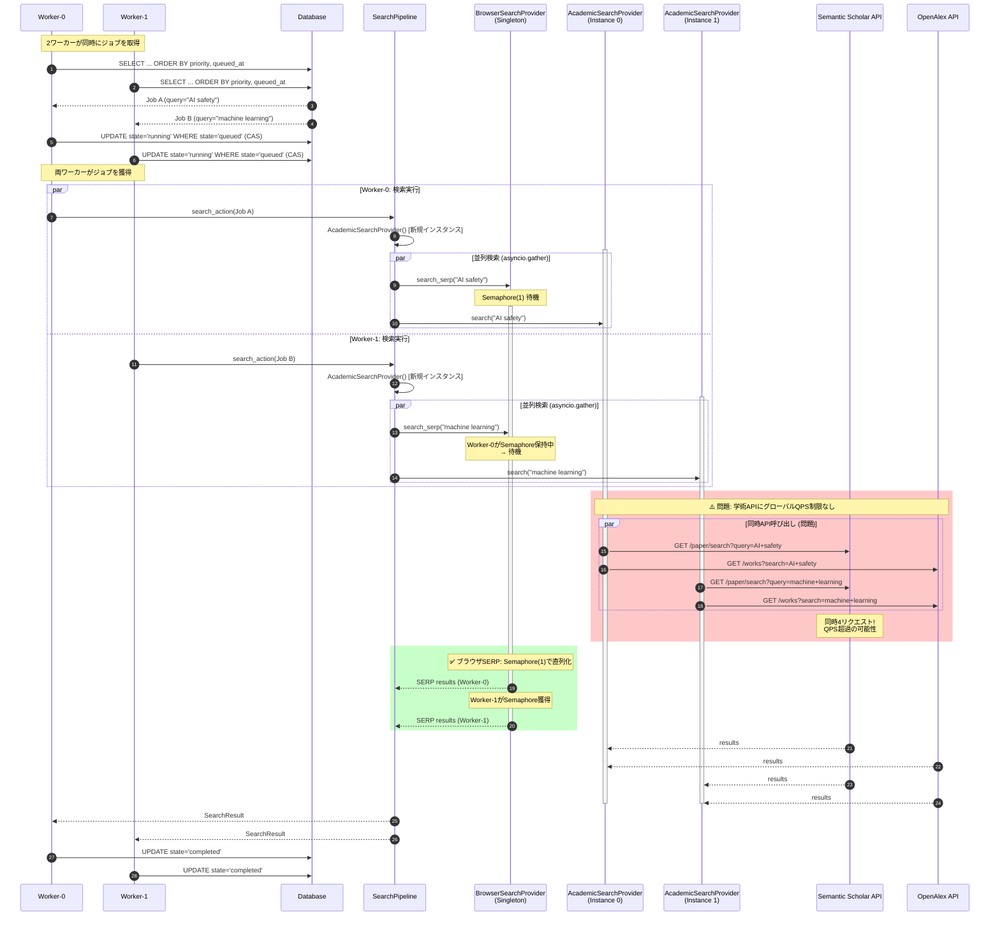

# SearchQueueWorker 同時実行シーケンス図

## 概要

2つのワーカーが同時に検索を処理する際のリソース競合とレート制限の流れを示す。

## シーケンス図



## 問題点

### 1. 学術API同時アクセス (❌ 問題)

- `AcademicSearchProvider` は各 `SearchPipeline.execute()` で新規インスタンス作成
- 各インスタンスは独自の `SemanticScholarClient` / `OpenAlexClient` を持つ
- **グローバルなQPS制限がない**
- 2ワーカー × 2 API = 最大4同時リクエスト

### 2. ブラウザSERP (✅ 問題なし)

- `get_browser_search_provider()` はシングルトンを返す
- `_rate_limiter = asyncio.Semaphore(1)` で同時1を保証
- 2ワーカーが同時に呼んでも直列化される

## 解決策

### Option A: 学術APIクライアントのシングルトン化

```python
# src/search/apis/base.py に追加
_clients: dict[str, BaseAcademicClient] = {}

def get_academic_client(name: str) -> BaseAcademicClient:
    if name not in _clients:
        if name == "semantic_scholar":
            _clients[name] = SemanticScholarClient()
        elif name == "openalex":
            _clients[name] = OpenAlexClient()
    return _clients[name]
```

### Option B: グローバルレートリミッター追加

```python
# src/search/apis/rate_limiter.py
class AcademicAPIRateLimiter:
    def __init__(self):
        self._locks: dict[str, asyncio.Lock] = {}
        self._last_request: dict[str, float] = {}
    
    async def acquire(self, api_name: str, min_interval: float = 0.1) -> None:
        # プロバイダー別にレート制限
```

### Option C: 現状維持（APIサーバー側制限に依存）

- Semantic Scholar / OpenAlex は寛容なレート制限（10+ req/s）
- 2ワーカー程度なら問題ない可能性
- ただし、スケール時に問題になる

## 推奨: Option B (グローバルレートリミッター)

- 既存コードへの影響が最小
- 将来のスケール対応も容易
- テストで検証可能

