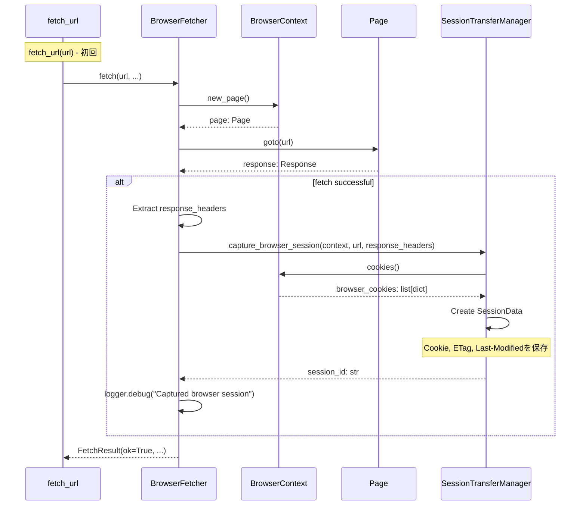
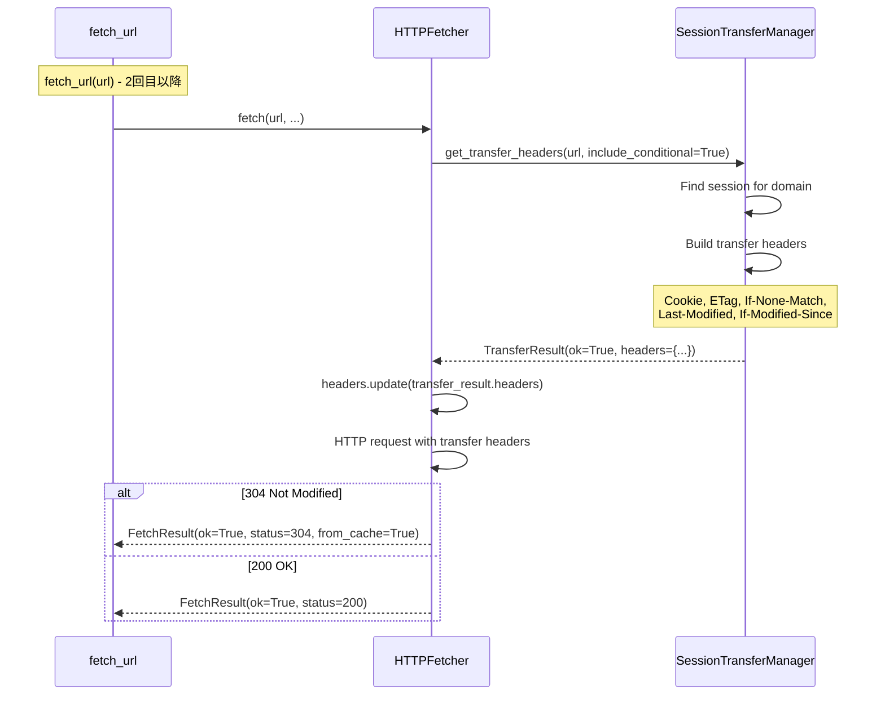
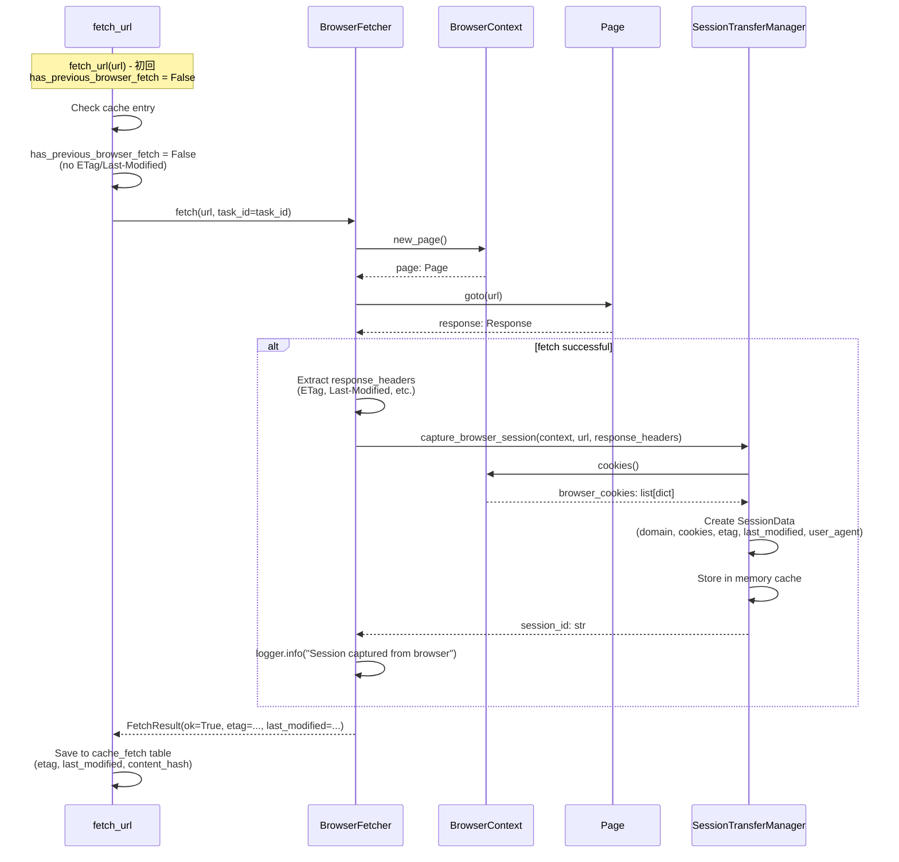
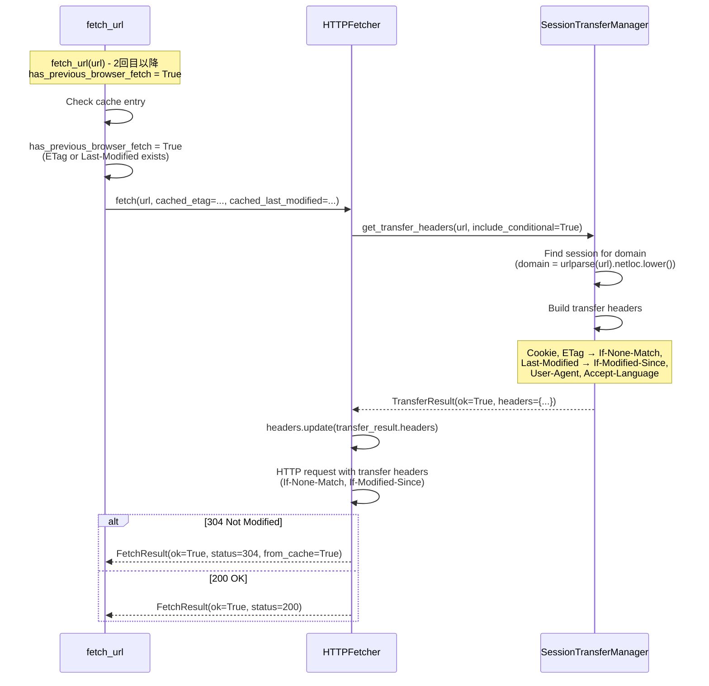

# セッション転送フロー（問題12）

## 概要

ブラウザで取得したセッションをHTTPクライアントに転送するフロー。初回はブラウザ経由、2回目以降はHTTPクライアントで304再訪。

## デバッグ前のシーケンス図

### 初回取得（ブラウザ経由）

### 2回目以降（HTTPクライアント経由）

## データ型

### SessionData（内部）
- `domain: str` - 登録可能ドメイン
- `cookies: list[CookieData]` - Cookie情報
- `etag: str | None` - ETag
- `last_modified: str | None` - Last-Modified
- `user_agent: str | None` - User-Agent
- `accept_language: str` - Accept-Language
- `last_url: str | None` - 最後にアクセスしたURL（Referer用）
- `created_at: float` - 作成時刻（Unix timestamp）
- `last_used_at: float` - 最終使用時刻（Unix timestamp）

### TransferResult
- `ok: bool` - 成功フラグ
- `session_id: str | None` - セッションID
- `headers: dict[str, str]` - 転送ヘッダー
  - `Cookie: str` - Cookieヘッダー
  - `If-None-Match: str` - ETag（条件付きリクエスト）
  - `If-Modified-Since: str` - Last-Modified（条件付きリクエスト）
  - `User-Agent: str` - User-Agent
  - `Accept-Language: str` - Accept-Language
- `reason: str | None` - エラー理由

## 非同期処理

- `capture_browser_session()`: `async def` - ブラウザコンテキストからセッション取得
- `cookies()`: `async def` - Playwright API呼び出し
- `get_transfer_headers()`: `def` - 同期的なヘッダー生成（内部でセッション検索）

## エラーハンドリング

- `capture_browser_session()`エラー: ログ出力して`None`を返却、通常フロー継続
- `get_transfer_headers()`でセッションが見つからない場合: `TransferResult(ok=False, reason="no_session_for_domain")`を返却
- セッション転送ヘッダー適用エラー: ログ出力して通常ヘッダーのみでリクエスト

## 初回/2回目以降の判定

- `fetch_url()`でキャッシュチェック
- キャッシュが存在し、ETag/Last-Modifiedがある場合: HTTPクライアント経由
- キャッシュが存在しない、またはETag/Last-Modifiedがない場合: ブラウザ経由

---

## デバッグ後のシーケンス図（実装完了版）

**実装状況**: ✅ 実装完了・動作確認済み

**変更点**:
- `fetch_url()`で初回はブラウザ経由、2回目以降はHTTPクライアント経由（304キャッシュ）を実装
- `BrowserFetcher.fetch()`が成功時に`capture_browser_session()`を呼び出し
- `HTTPFetcher.fetch()`が`get_transfer_headers()`でセッション転送ヘッダーを取得して適用

### 初回取得（ブラウザ経由） - 実装版

### 2回目以降（HTTPクライアント経由） - 実装版

**実装ファイル**:
- `src/crawler/fetcher.py`: `fetch_url()` (1793-1950行), `BrowserFetcher.fetch()` (1200-1250行), `HTTPFetcher.fetch()` (509-710行)
- `src/crawler/session_transfer.py`: `capture_browser_session()`, `get_transfer_headers()`

**検証**:
- ✅ `tests/scripts/debug_session_transfer_flow.py`で動作確認済み

