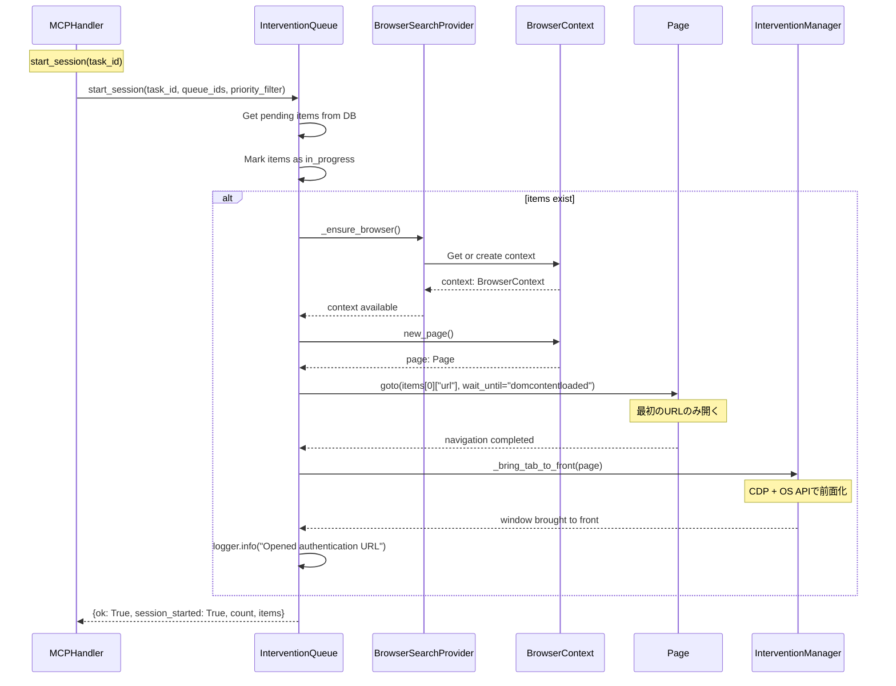
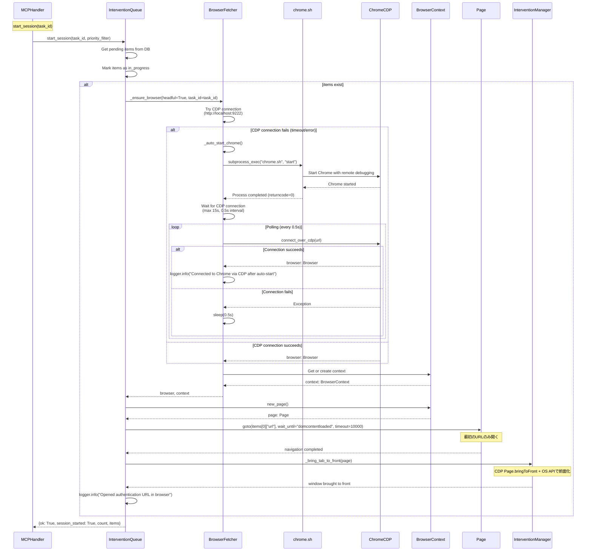

# start_sessionブラウザ起動フロー（問題5）

## 概要

`InterventionQueue.start_session()`で認証待ちURLをブラウザで開き、ウィンドウを前面化するフロー。

## デバッグ前のシーケンス図

## データ型

- `items: list[dict]`
  - `id: str` - キューID
  - `url: str` - 認証待ちURL
  - `domain: str` - ドメイン名
  - `auth_type: str` - 認証タイプ（"captcha", "login", etc.）
  - `priority: str` - 優先度（"high", "medium", "low"）

- 戻り値: `dict[str, Any]`
  - `ok: bool` - 成功フラグ
  - `session_started: bool` - セッション開始フラグ
  - `count: int` - 処理アイテム数
  - `items: list[dict]` - 処理アイテムリスト

## 非同期処理

- `start_session()`: `async def` - データベース操作とブラウザ操作
- `_ensure_browser()`: `async def` - ブラウザコンテキスト取得
- `new_page()`: `async def` - ページ作成
- `goto()`: `async def` - ページナビゲーション
- `_bring_tab_to_front()`: `async def` - ウィンドウ前面化

## エラーハンドリング

- `items`が空の場合: `session_started=False`で返却
- `_ensure_browser()`エラー: ログ出力してURLのみ返却（手動操作にフォールバック）
- `goto()`エラー: ログ出力してURLのみ返却
- `_bring_tab_to_front()`エラー: ログ出力して続行（URLは開かれている）

## 安全運用ポリシー

- `Page.navigate`のみ使用（DOM操作は禁止）
- `Page.bringToFront`とOS API併用で前面化
- 複数URLがある場合、最初のURLのみ開く（ユーザーが手動で他のURLを開く想定）

---

## デバッグ後のシーケンス図（実装完了版）

**実装状況**: ✅ 実装完了・動作確認済み

**変更点**:
- `InterventionQueue.start_session()`が`BrowserFetcher._ensure_browser(headful=True)`を呼び出し
- `BrowserFetcher._ensure_browser()`がChrome自動起動機能を実装（CDP接続失敗時に`chrome.sh start`を自動実行）
- Chrome自動起動後、最大15秒間CDP接続を待機（0.5秒間隔でポーリング）

**実装ファイル**:
- `src/utils/notification.py`: `InterventionQueue.start_session()` (1100-1200行)
- `src/crawler/fetcher.py`: `BrowserFetcher._ensure_browser()` (738-900行), `BrowserFetcher._auto_start_chrome()` (905-960行)

**Chrome自動起動の詳細**:
- CDP接続タイムアウト: 5秒
- `chrome.sh start`実行タイムアウト: 30秒
- CDP接続待機: 最大15秒、0.5秒間隔でポーリング
- 自動起動失敗時: ローカルヘッドフルブラウザを起動（フォールバック）

**検証**:
- ✅ `tests/scripts/debug_start_session_browser_flow.py`で動作確認済み
- ✅ `tests/scripts/debug_chrome_auto_start.py`でChrome自動起動機能を検証済み

