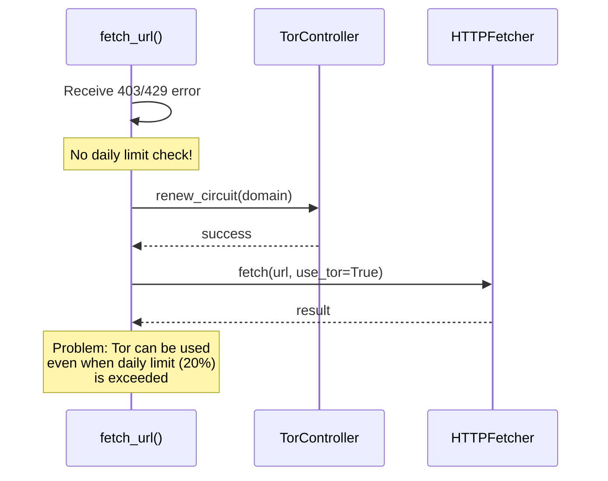
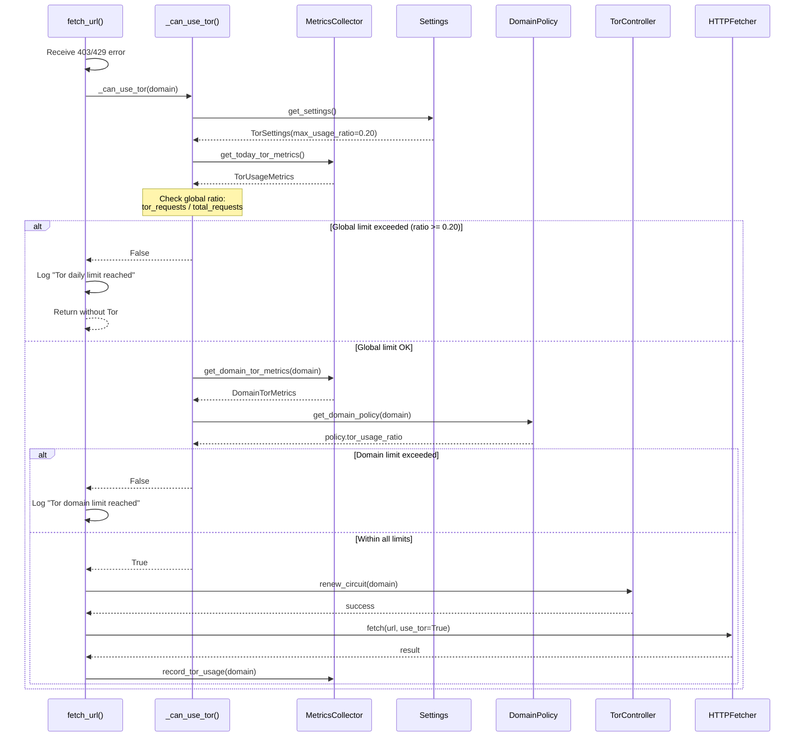

# Tor日次利用上限チェックフロー（問題10）

## 概要

fetch_url()でTorを使用する前に、日次の利用上限（20%）をチェックするフロー。
グローバルな日次上限とドメイン別の上限の両方を確認し、上限を超えている場合はTor使用をスキップする。

## 仕様要件

- **§4.3**: "ドメイン単位のTor粘着（15分）と日次のTor利用上限（割合/回数）を適用"
- **§7**: "Tor利用率: 全取得に占めるTor経路の割合≤20%（日次上限とドメイン別上限を両方満たすこと）"
- **§4.3**: "ドメイン別の`tor_usage_ratio`でドメイン固有の上限も管理"

## 現状の問題点



## 問題点

1. **日次利用上限のチェックなし**: Torを使用する前に、日次の利用上限（`max_usage_ratio: 0.20`）をチェックしていない
2. **利用状況の追跡なし**: Tor使用回数や割合を追跡するメトリクスがない
3. **グローバル上限の適用なし**: ドメイン別の`tor_usage_ratio`はあるが、グローバルな日次上限のチェックがない

## 設定値

| 設定 | 値 | 説明 |
|-----|---|-----|
| `settings.tor.max_usage_ratio` | 0.20 | グローバル日次上限（20%） |
| `domain_policy.tor_usage_ratio` | 0.20〜0.50 | ドメイン別上限 |

---

## デバッグ後のシーケンス図（実装版）



## データ型

### TorUsageMetrics（Pydantic - モジュール間データ受け渡し）

```python
class TorUsageMetrics(BaseModel):
    """Daily Tor usage metrics for rate limiting."""
    
    total_requests: int = Field(default=0, ge=0, description="Total requests today")
    tor_requests: int = Field(default=0, ge=0, description="Tor requests today")
    date: str = Field(..., description="Date in YYYY-MM-DD format")
    
    @property
    def usage_ratio(self) -> float:
        """Calculate current Tor usage ratio."""
        if self.total_requests == 0:
            return 0.0
        return self.tor_requests / self.total_requests
```

### DomainTorMetrics（Pydantic - モジュール間データ受け渡し）

```python
class DomainTorMetrics(BaseModel):
    """Domain-specific Tor usage metrics."""
    
    domain: str = Field(..., description="Domain name")
    total_requests: int = Field(default=0, ge=0, description="Total requests for domain today")
    tor_requests: int = Field(default=0, ge=0, description="Tor requests for domain today")
    
    @property
    def usage_ratio(self) -> float:
        """Calculate domain Tor usage ratio."""
        if self.total_requests == 0:
            return 0.0
        return self.tor_requests / self.total_requests
```

## 主要関数

### `_can_use_tor(domain: str | None = None) -> bool`

```python
async def _can_use_tor(domain: str | None = None) -> bool:
    """Check if Tor can be used based on daily limits.
    
    Per §4.3 and §7: Check both global daily limit (20%) and domain-specific limit.
    
    Args:
        domain: Optional domain for domain-specific check.
        
    Returns:
        True if Tor can be used, False if limit reached.
    """
```

### MetricsCollector拡張メソッド

- `get_today_tor_metrics() -> TorUsageMetrics`: 当日のTor使用メトリクスを取得
- `get_domain_tor_metrics(domain: str) -> DomainTorMetrics`: ドメイン別Tor使用メトリクスを取得
- `record_tor_usage(domain: str) -> None`: Tor使用を記録

## 非同期処理

- `_can_use_tor(domain)`: `async def` - ドメインポリシー取得が非同期の場合に対応
- `get_today_tor_metrics()`: `def` - 同期関数（メモリ内カウンター参照）
- `record_tor_usage(domain)`: `def` - 同期関数（メモリ内カウンター更新）

## エラーハンドリング

- メトリクス取得失敗: Tor使用を許可（フェイルオープン）
- ドメインポリシー取得失敗: グローバル上限のみ適用
- 日付変更検知: カウンターをリセット

## 日付リセット

メトリクスは日付変更時に自動リセットされる:

```python
if metrics.date != today:
    metrics.total_requests = 0
    metrics.tor_requests = 0
    metrics.date = today
```

---

## 実装ファイル

| ファイル | 変更内容 |
|---------|---------|
| `src/utils/schemas.py` | `TorUsageMetrics`, `DomainTorMetrics` Pydanticモデル追加 |
| `src/utils/metrics.py` | `get_today_tor_metrics()`, `get_domain_tor_metrics()`, `record_tor_usage()` 追加 |
| `src/crawler/fetcher.py` | `_can_use_tor()` 関数追加、`fetch_url()` でTor使用前にチェック |

## テスト

- `tests/test_tor_daily_limit.py` - ユニットテスト
- `tests/scripts/debug_tor_daily_limit_flow.py` - デバッグ用一直線スクリプト

## テスト観点表

| Case ID | Input / Precondition | Perspective | Expected Result |
|---------|---------------------|-------------|-----------------|
| TC-TOR-N-01 | 0% usage | Equivalence – normal | `_can_use_tor()` returns True |
| TC-TOR-N-02 | 19% usage | Boundary – below limit | `_can_use_tor()` returns True |
| TC-TOR-B-01 | 20% usage | Boundary – at limit | `_can_use_tor()` returns False |
| TC-TOR-B-02 | 21% usage | Boundary – above limit | `_can_use_tor()` returns False |
| TC-TOR-N-03 | Domain limit exceeded | Equivalence – domain | `_can_use_tor(domain)` returns False |
| TC-TOR-N-04 | New day reset | Equivalence – reset | Metrics reset to 0 |
| TC-TOR-A-01 | Metrics retrieval fails | Equivalence – error | `_can_use_tor()` returns True (fail-open) |
| TC-TOR-N-05 | First request of day | Boundary – 0 requests | `_can_use_tor()` returns True |
