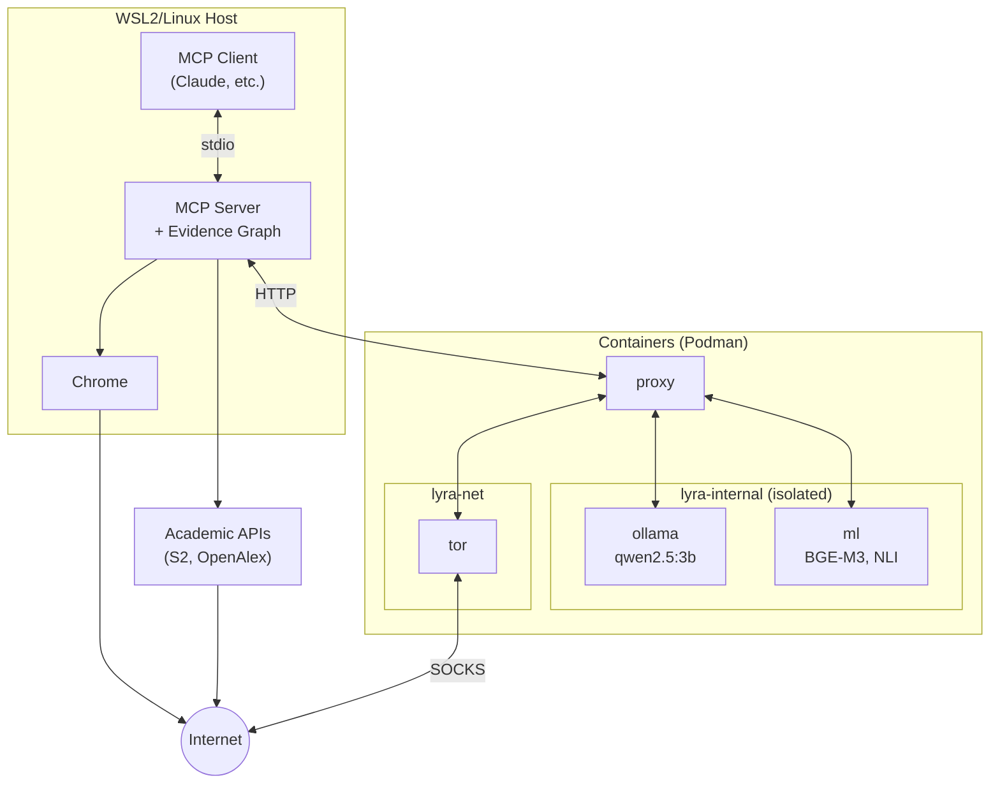
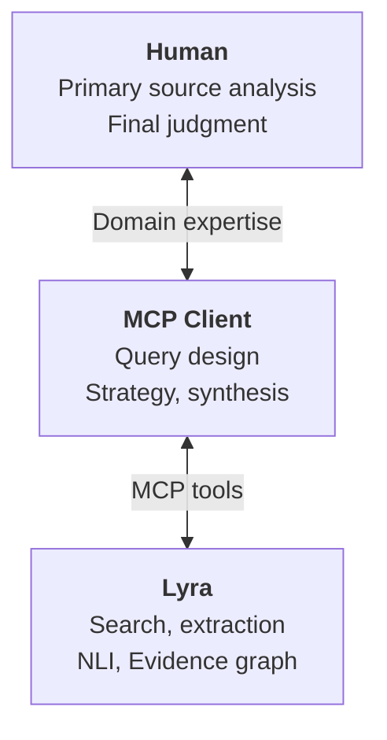
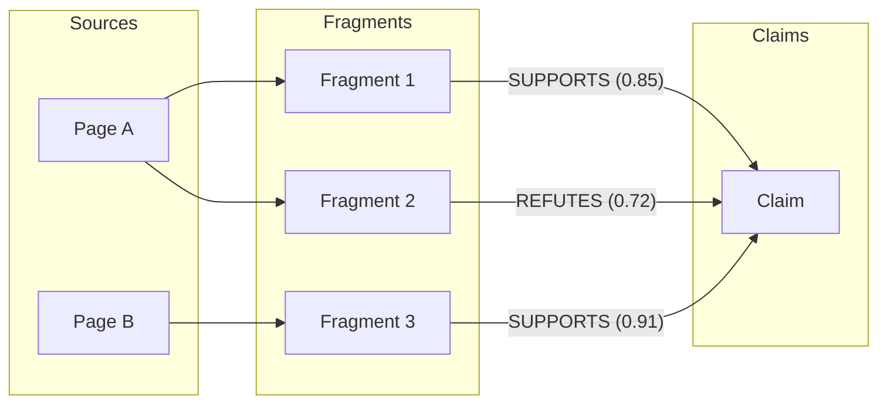

# Summary

Lyra is an open-source server implementing the Model Context Protocol (MCP) that enables AI assistants to conduct desktop research using structured provenance, providing accurate and auditable evidence. The software exposes research capabilities—web search, content extraction, natural language inference, and evidence graph construction—as structured tools that MCP-compatible AI clients can invoke directly.

I designed Lyra around a **thinking-working separation** architecture (Figure 1). The high-reasoning LLM in the MCP client handles strategic reasoning such as query design and synthesis, while Lyra executes mechanical tasks including search, extraction, and classification. Lyra functions as a navigation tool: it discovers and organizes relevant sources, while detailed analysis of primary sources remains the researcher's responsibility.

**Figure 1.** System architecture. The MCP server runs on the host; ML inference containers are network-isolated to prevent data exfiltration.

**Figure 2.** Three-layer collaboration. Strategic reasoning resides in the MCP client; Lyra executes mechanical tasks. Primary source analysis remains the researcher's responsibility.

The software incorporates three machine learning components for local GPU inference: a 3B-parameter language model for claim extraction, BGE-M3 embeddings for semantic search, and a DeBERTa-based classifier for stance detection. Lyra constructs an **evidence graph** linking extracted claims to source fragments with structured provenance metadata (Figure 3). Each claim accumulates a Bayesian confidence score calculated via Beta distribution updating over evidence edges weighted by Natural Language Inference (NLI) judgments (supports, refutes, or neutral), enabling transparent assessment of evidence quality.

**Figure 3.** Evidence graph structure. Fragments extracted from pages link to claims with NLI stance labels. Bayesian confidence aggregates weighted evidence.

# Statement of Need

In any research activity, the auditability of information—the ability to trace which sources a claim is based on—is essential for verifying conclusions and enabling reproducibility. However, Transformer-based large language models are inherently probabilistic, generating outputs through statistical patterns rather than deterministic reasoning. While various mitigation strategies address hallucination, these are not designed for academic-level auditability. Verifying that AI-generated citations accurately reflect source materials requires substantial manual effort. Existing search and retrieval systems, though effective for their intended purposes, do not prioritize structured provenance tracking that would facilitate such verification.

Existing tools address different aspects of research workflows. Cloud-based research assistants such as Perplexity AI and Elicit excel at rapid information retrieval with citation links. Browser automation frameworks such as Selenium and Playwright offer flexible programmatic access for custom workflows. Retrieval-Augmented Generation (RAG) frameworks such as LangChain and LlamaIndex specialize in document retrieval and context augmentation. These tools serve their intended purposes well. For researchers who prioritize auditable evidence chains, Lyra offers a different approach.

From a context engineering perspective, Lyra constructs a transparent evidence graph that provides AI clients with accurate, traceable information. Every claim links to source fragments, which link to page URLs, creating an auditable chain from assertion to origin. The graph explicitly represents both supporting and refuting evidence, with Bayesian confidence scores quantifying the balance. Researchers can trace any claim back to its source text and evaluate the reasoning path themselves.

The software runs entirely on local hardware, eliminating dependence on external APIs and ensuring research data remains under researcher control. Multi-source search aggregates browser-based web search and academic APIs (Semantic Scholar, OpenAlex) with Digital Object Identifier (DOI) based deduplication. A human-in-the-loop mechanism enables researchers to correct NLI judgments; these corrections are accumulated for planned domain adaptation via Low-Rank Adaptation (LoRA) fine-tuning.

The software comprises approximately 76,000 lines of Python source code and 95,000 lines of tests. I documented design rationale in 17 Architecture Decision Records covering local-first principles, evidence graph structure, and security models.

# Acknowledgements

Lyra builds upon several open-source projects: Ollama for local language model runtime, Playwright for browser automation, Trafilatura for web content extraction, and Hugging Face Transformers for NLI and embedding models. Academic metadata is provided by the Semantic Scholar and OpenAlex APIs.

# References
